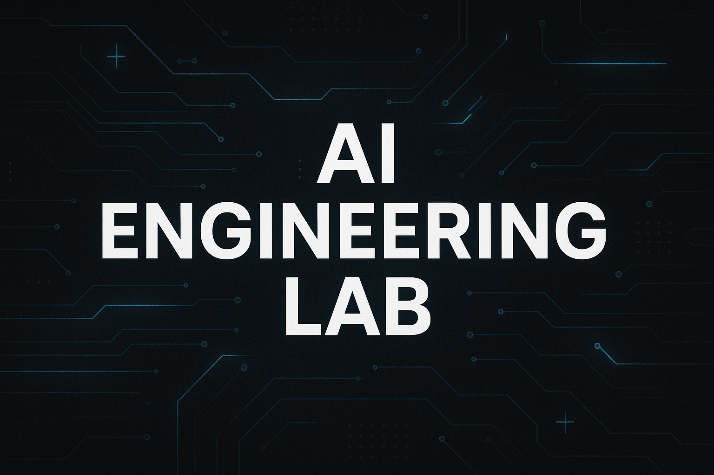

# 🧠 AI Engineering Lab
<p align="center">
  
</p>


A hands-on workspace for exploring the intersection of **AI engineering**, **prompt design**, **machine learning**, and **AI ethics**.  
This repository combines practical scripts, research notebooks, and ethical evaluation tools for modern AI workflows.

---

## 🔍 Overview

This project demonstrates:
- **Prompt engineering** techniques and reproducible test frameworks  
- **LLM-assisted code generation** workflows and experiments  
- **Ethical AI** simulations for bias detection and fairness evaluation  
- **Custom Python scripts** for training, evaluating, and validating models  

---

## 📂 Repository Structure

| Folder | Description |
|--------|--------------|
| `/notebooks` | Interactive Jupyter notebooks for ML, prompt tuning, and ethics experiments |
| `/scripts` | Automation, training, and evaluation tools written in Python |
| `/datasets` | Example datasets for fine-tuning, evaluation, and simulation |
| `/docs` | Architecture diagrams, frameworks, and supporting documentation |

---

## 🧰 Technologies Used

- Python 3.11+  
- PyTorch / TensorFlow (optional, for experimentation)  
- Hugging Face Transformers or OpenAI API  
- Scikit-learn, Pandas, NumPy, Matplotlib  
- JupyterLab  

---

## 🌐 Example Notebooks

| Notebook | Focus |
|-----------|--------|
| **Prompt Engineering 101** | Explore system/user prompting, few-shot patterns, and scoring harnesses |
| **Bias Detection Pipeline** | Run fairness audits across text datasets |
| **Ethical Simulation** | Model ethical dilemmas and AI decision constraints |

---

## ⚖️ Ethics & Responsible AI

Includes practical components for:
- Fairness and bias evaluation  
- Transparency and reproducibility tracking  
- Privacy-preserving dataset design  
- Auditability and explainability metrics  

Each simulation or model experiment is aligned with ethical development principles outlined in `/docs/ethics_framework_overview.md`.

---

## 🚀 Quickstart

```bash
# Create and activate a virtual environment
python -m venv .venv
source .venv/bin/activate        # macOS/Linux
# or
.venv\Scripts\activate           # Windows

# Install dependencies
pip install -r requirements.txt

# Launch JupyterLab
jupyter lab
```

Run the command-line experiments directly:

```bash
# Run the full no-API lab workflow
python scripts/run_lab_workflow.py --output-dir outputs/lab_run

# Summarize the completed run
python scripts/summarize_lab_run.py \
  --manifest outputs/lab_run/manifest.json \
  --output outputs/lab_run/summary.md

# Generate a model card from a completed training run
python scripts/generate_model_card.py \
  --summary outputs/lab_run/sentiment_model_summary.json \
  --output outputs/lab_run/sentiment_model_card.md

# Generate prompt variants from the sample topic list
python scripts/generate_prompts.py \
  --input datasets/sample_prompts.csv \
  --output outputs/generated_prompts.json \
  --with-metadata \
  --dedupe

# Train the sample sentiment model
python scripts/train_model.py \
  --data datasets/sentiment_training.json \
  --model outputs/sentiment_model.joblib \
  --summary outputs/sentiment_model_summary.json
```

For one compact path through prompt generation, bias review, and sentiment training, see [docs/lab_walkthrough.md](docs/lab_walkthrough.md).
For sample dataset schemas, row counts, and fingerprints, see [docs/dataset_catalog.md](docs/dataset_catalog.md).
For prompt-batch scoring guidance, see [docs/prompt_evaluation.md](docs/prompt_evaluation.md).
For the training data contract, run metadata, and baseline limitations, see [docs/model_baseline.md](docs/model_baseline.md).

## ✅ Validation

Run the built-in test suite before changing scripts:

```bash
pip install -r requirements-test.txt
python scripts/validate_repo.py
```

---

## 🧾 License
MIT License © 2025 Claney
